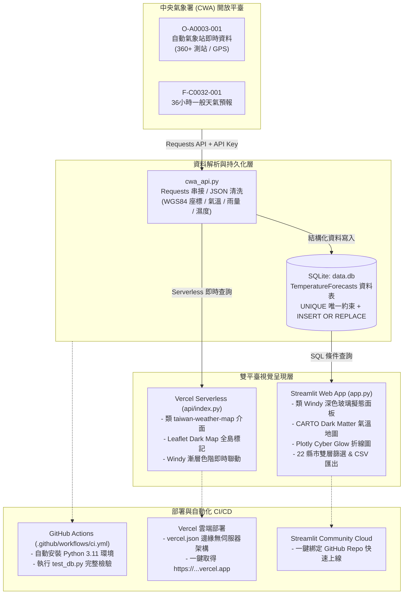

# 🇹🇼 AIoT L3 - 臺灣中央氣象署 (CWA) 氣象觀測與視覺化系統

[](https://github.com/Augustine-723/AIoT_L3_CWA_HW1/actions/workflows/ci.yml)
[](LICENSE)
[](https://www.python.org/)
[](https://vercel.com)

本專案為 **AIoT L3 HW1** 作業成果，參考 [taiwan-weather-map.vercel.app](https://taiwan-weather-map.vercel.app/) 的視覺設計，打造**類 Windy 風格高質感深色玻璃擬態氣象觀測系統**。

整合**中央氣象署 (CWA) 開放資料平臺 API (主推 `O-A0003-001` 自動氣象站即時觀測資料)**、**SQLite 本地資料庫**、**Streamlit 互動式 Web App**、**Folium / Leaflet 地圖地理視覺化 (360+ 測站 GPS 精確定位)**、**Plotly 霓虹動態氣溫折線圖**，並支援 **GitHub Actions CI 自動化工作流** 與 **Vercel / Streamlit Cloud 雲端一鍵部署**。

---

## 🔄 系統資料管線與工作流架構 (Data Pipeline & Workflow)



---

## 🌟 專案核心特色

1. **📡 CWA 開放資料即時串接**
   - **`O-A0003-001` (預設主資料集)**：全臺 360+ 個自動測站之當前氣溫 (`AirTemperature`)、當日最高溫 (`DailyHigh`)、當日最低溫 (`DailyLow`)、雨量、濕度與精準 **WGS84 經緯度座標**。
   - **`F-C0032-001` (預報模式)**：今明 36 小時天氣預報，支援即時切換。
   - 內建離線示範資料生成器，無網路或未配置 API Key 亦能即時啟動體驗。

2. **🌌 類 Windy 暗黑擬態科技美學 (Dark Cyber Glassmorphism)**
   - 參考 `taiwan-weather-map.vercel.app` 設計，使用深色夜幕漸層底圖。
   - **Windy 溫標漸層色帶**：`5°C (深藍)` ➔ `16°C (薄荷綠)` ➔ `24°C (溫黃)` ➔ `28°C (暖橙)` ➔ `32°C (橙紅)` ➔ `36°C+ (酷熱紅)`。
   - **CARTO Dark Matter 地圖**：以發光圓點動態呈現全島 360+ 個氣象站點，點擊彈出高質感暗黑浮動卡片 (Popup)。

3. **💾 健壯的 SQLite 資料庫設計**
   - 資料庫檔案為 `data.db`，資料表 `TemperatureForecasts` 支援經緯度欄位 (`lat`, `lon`)。
   - 設有 `UNIQUE(location_name, start_time, end_time)` 複合唯一鍵，搭配 `INSERT OR REPLACE` 機制防範重疊寫入。

4. **🔒 業界標準資安實踐**
   - API Key 嚴格儲存於後端環境變數 ([`.env`](.env))，網頁前端不設置任何輸入框或明文暴露。
   - [`.env`](.env) 已納入 [`.gitignore`](.gitignore)，絕不上傳公開倉儲。

---

## 🏗️ 專案檔案結構

```plaintext
AIoT_L3_CWA_HW1/
├── .github/
│   └── workflows/
│       └── ci.yml             # GitHub Actions CI 自動化測試工作流程
├── api/
│   └── index.py               # Vercel Serverless 雲端部署進入點 (Windy 風格全島地圖)
├── app.py                     # Streamlit 主程式 (CARTO Dark Matter 地圖、Plotly 折線圖)
├── cwa_api.py                 # 中央氣象署 API 串接與資料清洗 (O-A0003-001 & F-C0032-001)
├── database.py                # SQLite data.db 資料庫連線、自動擴充經緯度與 SQL 查詢
├── test_db.py                 # 資料庫寫入、防重覆驗證與 SQL 查詢自動化測試腳本
├── requirements.txt           # 專案 Python 套件清單
├── vercel.json                # Vercel 雲端部署路由與環境設定檔
├── .env.example               # 環境變數設定檔範本
├── .gitignore                 # Git 忽略設定 (排除 data.db, .env, .venv 等暫存檔)
└── README.md                  # 專案完整說明與工作流文件
```

---

## 🔑 中央氣象署 API Key 申請教學

1. 前往 [中央氣象署開放資料平臺](https://opendata.cwa.gov.tw/)。
2. 點擊右上角 **「註冊 / 登入」**，完成會員註冊。
3. 前往 **「取得授權碼」** 頁面 ([https://opendata.cwa.gov.tw/user/authkey](https://opendata.cwa.gov.tw/user/authkey))。
4. 點擊 **「產生授權碼」**，取得以 `CWA-` 開頭的字串。
5. 在專案根目錄建立 `.env` 檔案並填入金鑰：
   ```bash
   CWA_API_KEY=CWA-XXXXXXXXXXXXXXXXXXXXXXXXXXXX
   ```

---

## 🚀 本地開發與執行 (Local Quickstart)

### 1. 複製專案
```bash
git clone https://github.com/Augustine-723/AIoT_L3_CWA_HW1.git
cd AIoT_L3_CWA_HW1
```

### 2. 安裝套件
```bash
pip install -r requirements.txt
```

### 3. 設定環境變數
```bash
cp .env.example .env
# 編輯 .env 填入你的 CWA_API_KEY
```

### 4. 執行自動化測試
```bash
python test_db.py
```
若輸出 `[ALL PASS] 所有 SQLite 資料庫與氣象資料解析測試皆順利通過！` 即表示資料庫與解析功能皆正常。

### 5. 啟動 Streamlit 應用程式
```bash
streamlit run app.py
```
瀏覽器將自動開啟 `http://localhost:8501`。

---

## ☁️ 雲端部署指南 (Deployment Workflow)

### 🌐 途徑 A：部署至 Vercel (推薦，如參考網站)

本專案已內建 `vercel.json` 與 `api/index.py`，支援 Vercel 一鍵無伺服器部署：

1. 前往 [Vercel 官網](https://vercel.com) 並以 **GitHub 帳號登入**。
2. 點擊 **「Add New...」➔「Project」**。
3. 在專案清單中選擇 **`Augustine-723/AIoT_L3_CWA_HW1`**，點擊 **「Import」**。
4. 在 **Environment Variables** 區域新增：
   - **Key**: `CWA_API_KEY`
   - **Value**: `你的 CWA 授權碼`
5. 點擊 **「Deploy」** 按鈕。
6. 等候約 15 秒，即可獲得專屬網址（例如：`https://aiot-l3-cwa-hw1.vercel.app`）！

> 💡 **自動持續部署 (CD)**：未來只要你推送程式碼至 GitHub `main` 分支，Vercel 將自動觸發重新建置與發布。

---

### 🎈 途徑 B：部署至 Streamlit Community Cloud

若偏好完整呈現 Streamlit 原生介面：

1. 前往 [Streamlit Community Cloud](https://share.streamlit.io/) 並登入 GitHub。
2. 點擊 **「New app」**。
3. 設定：
   - **Repository**: `Augustine-723/AIoT_L3_CWA_HW1`
   - **Branch**: `main`
   - **Main file path**: `app.py`
4. 點開 **Advanced settings** ➔ **Secrets**，貼入：
   ```toml
   CWA_API_KEY = "你的 CWA 授權碼"
   ```
5. 點擊 **「Deploy!」**，應用程式將在 2 分鐘內上線。

---

## ⚙️ GitHub Actions CI 工作流說明

專案內建 [`.github/workflows/ci.yml`](.github/workflows/ci.yml)：

- **觸發時機**：每當有程式碼推送 (`push`) 或發起拉取請求 (`pull_request`) 至 `main` 分支時自動啟動。
- **自動化步驟**：
  1. 檢出程式碼 (`actions/checkout@v4`)。
  2. 配置 Python 3.11 測試環境 (`actions/setup-python@v5`)。
  3. 安裝專案相依套件 (`pip install -r requirements.txt`)。
  4. 執行 `test_db.py` 驗證 SQLite 資料庫讀寫、SQL 條件篩選、複合唯一鍵約束與氣象資料解析。

確保每一次程式碼更新都能維持 100% 正確性與穩定品質！

---

## 🗄️ 資料庫結構 (Database Schema)

| 欄位名稱 | 型態 | 說明 | 備註 |
| :--- | :--- | :--- | :--- |
| `id` | INTEGER | 主鍵 (Primary Key) | 自動遞增 |
| `location_name` | TEXT | 測站或地區名稱 | 例如：臺北市 - 臺北、新北市 - 板橋 |
| `start_time` | TEXT | 觀測或預報起始時間 | `YYYY-MM-DD HH:MM:SS` |
| `end_time` | TEXT | 觀測或預報結束時間 | `YYYY-MM-DD HH:MM:SS` |
| `min_temp` | REAL | 最低溫度 / 當日最低溫 | 攝氏度 (°C) |
| `max_temp` | REAL | 最高溫度 / 當日最高溫 | 攝氏度 (°C) |
| `weather_condition`| TEXT | 天氣現象 (Wx) | 例如：多雲時晴、陰局部雨 |
| `rain_prob` | TEXT | 雨量或降雨機率 | 例如：0.0 mm、20% |
| `comfort_index` | TEXT | 大氣指標 | 例如：濕度 65%, 氣壓 1013 hPa |
| `lat` | REAL | 測站緯度 (WGS84) | 供 Leaflet / Folium 精準地圖定位 |
| `lon` | REAL | 測站經度 (WGS84) | 供 Leaflet / Folium 精準地圖定位 |
| `created_at` | TIMESTAMP| 資料寫入時間 | 預設為當前時間戳記 |

---

## 📝 授權聲明 (License)
本專案為學習與作業評量用途開源釋出。氣象資料來源屬於 [中華民國中央氣象署開放資料平臺](https://opendata.cwa.gov.tw/)。
