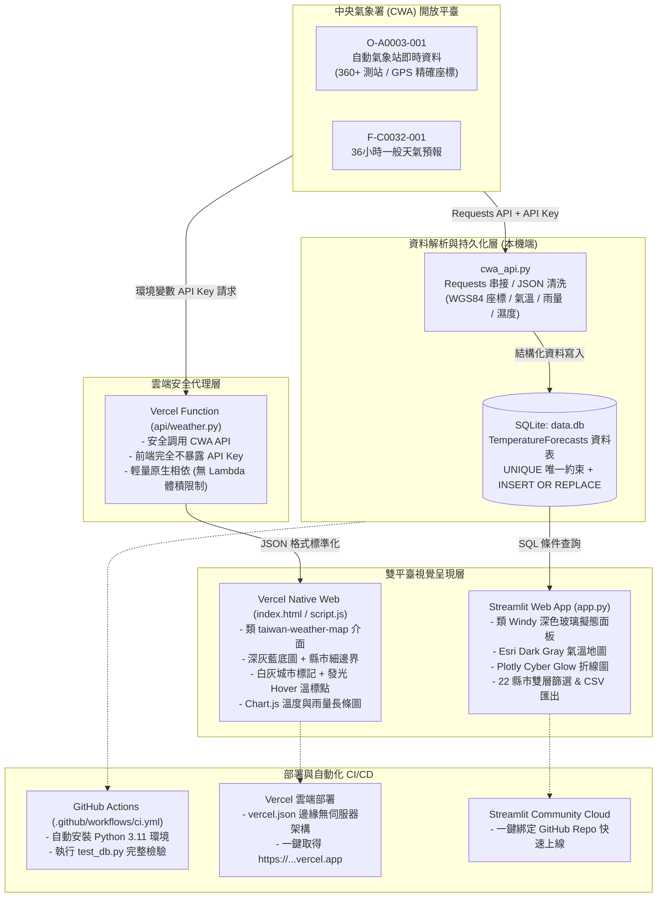

# 🇹🇼 AIoT L3 - 臺灣中央氣象署 (CWA) 氣象觀測與視覺化系統

[](https://github.com/Augustine-723/AIoT_L3_CWA_HW1/actions/workflows/ci.yml)
[](LICENSE)
[](https://www.python.org/)
[](https://vercel.com)


本專案為 **AIoT L3 HW1** 作業成果，參考 [taiwan-weather-map.vercel.app](https://taiwan-weather-map.vercel.app/) 的視覺設計，打造**類 Windy 風格高質感深色玻璃擬態氣象觀測系統**。

具備**雙架構雙平臺支援**：
1. **本機完整版 (Streamlit + SQLite)**：保留原生作業要求之 `app.py`、`database.py` 與 `data.db`，支援完整 SQL 條件過濾、互動圖表、CSV 匯出與單元測試。
2. **Vercel 雲端原生版 (HTML5 + Leaflet + Chart.js + Serverless)**：透過 Serverless 代理 API (`api/weather.py`) 安全串接 CWA API，前端嚴格隱藏 API 金鑰，具備響應式深灰藍地圖、發光測站標記與即時氣象儀表板。

---

## 🔄 系統資料管線與工作流架構 (Data Pipeline & Workflow)



---

## 🌟 專案核心特色

1. **📡 CWA 開放資料即時串接**
   - **`O-A0003-001` (預設主資料集)**：全臺 360+ 個自動測站之當前氣溫 (`AirTemperature`)、當日最高溫 (`DailyHigh`)、當日最低溫 (`DailyLow`)、雨量、濕度與精準 **WGS84 經緯度座標**。
   - **`F-C0032-001` (預報模式)**：今明 36 小時天氣預報，支援即時切換。
   - 內建離線示範資料生成器，無網路或未配置 API Key 亦能即時啟動體驗。

2. **🌌 類 Windy 暗黑擬態科技美學 (Dark Cyber Glassmorphism)**
   - 參考 `taiwan-weather-map.vercel.app` 設計，採用專業深色氣象基底。
   - **底圖配置**：海洋深藍黑 (`#111726`)、陸地深灰藍 (`#1f2937`)、淡化道路降低干擾。
   - **行政區細邊界**：載入全臺 22 縣市 GeoJSON 幾何邊界 (`tw_counties.js`)，地區邊界清晰俐落。
   - **重要代表城市**：台北、新北、台中、高雄、花蓮、台東以簡潔白灰標示，避免鄉鎮繁雜干擾。
   - **Marker 光暈與動態**：半透明白色外框 + 霓虹 Glow 陰影，滑鼠 Hover 即時放大，點擊呈現詳細觀測數據彈窗。
   - **Windy 溫標漸層色帶**：`5°C (深藍)` ➔ `16°C (湖綠)` ➔ `24°C (溫黃)` ➔ `28°C (暖橙)` ➔ `32°C (橙紅)` ➔ `36°C+ (酷熱紅)`。
   - **無浮水印地圖**：全面採用 Esri World Dark Gray Canvas 免費圖層，無任何第三方付費授權浮水印。

3. **🔒 雲端資安與邊緣代理 (Vercel Serverless Function)**
   - 前端 JavaScript 絕不直接寫入 `CWA-55FDA...` 金鑰。
   - 由後端 `/api/weather` (`api/weather.py`) 從 Vercel 環境變數讀取 `CWA_API_KEY`，轉發呼叫並回傳結構化氣象資料。

4. **⚡ 輕量化部署架構 (Zero-Bloat Lambda)**
   - 將龐大的本機分析套件 (Streamlit, Pandas, Plotly) 分流至 `requirements-streamlit.txt`。
   - 專案根目錄 `requirements.txt` 維持羽量級，徹底根除 Vercel Serverless Function 250MB 檔案大小上限錯誤。

---

## 📂 專案目錄結構

```text
AIoT_L3_CWA_HW1/
│
├── api/
│   ├── weather.py            # Vercel Serverless 代理 API (隱藏 CWA 金鑰)
│   └── requirements.txt      # 雲端函數專用羽量套件設定
│
├── assets/
│   └── preview.png           # 系統介面展示截圖
│
├── index.html                # Vercel 原生前端入口 (類 Windy 玻璃擬態面板)
├── script.js                 # 前端互動邏輯 (Leaflet 地圖、Chart.js 圖表、氣象渲染)
├── style.css                 # 深色擬態樣式表 (深灰藍海洋、霓虹光暈、玻璃模糊)
├── tw_counties.js            # 臺灣 22 縣市 GeoJSON 行政邊界資料
├── vercel.json               # Vercel 路由導向設定 (/api/weather -> api/weather.py)
├── .vercelignore             # 排除本機龐大暫存檔，加速雲端建置
│
├── app.py                    # Streamlit 原生 Web 應用程式 (作業完整版)
├── database.py               # SQLite 資料庫操作模組 (CRUD & SQL 篩選)
├── cwa_api.py                # CWA 開放資料串接與結構化清洗模組
├── test_db.py                # 單元測試腳本 (6 大步驟自動驗證)
├── data.db                   # 本機 SQLite 資料庫實體檔案
├── requirements.txt          # 雲端部署專用精簡相依清單
├── requirements-streamlit.txt# 本機 Streamlit + SQLite 完整環境相依清單
└── README.md                 # 專案詳細說明與架構文檔
```

---

## 🚀 本機執行教學 (Local Streamlit & SQLite)

### 1. 複製專案
```bash
git clone https://github.com/Augustine-723/AIoT_L3_CWA_HW1.git
cd AIoT_L3_CWA_HW1
```

### 2. 建立虛擬環境並安裝完整相依套件
```bash
python -m venv .venv
# Windows:
.venv\Scripts\activate
# macOS / Linux:
source .venv/bin/activate

# 安裝包含 Streamlit、Pandas、Plotly 的完整套件清單：
pip install -r requirements-streamlit.txt
```

### 3. 設定環境變數
```bash
cp .env.example .env
# 編輯 .env 填入你的 CWA_API_KEY
```

### 4. 執行自動化測試
```bash
python test_db.py
```
若輸出 `[ALL PASS] 所有 SQLite 資料庫與氣象資料解析測試皆順利通過！` 即表示資料庫與解析功能皆正常。

### 5. 啟動 Streamlit 應用程式
```bash
streamlit run app.py
```
瀏覽器將自動開啟 `http://localhost:8501`。

---

## ☁️ 雲端部署指南 (Vercel Deployment)

本專案完美支援 Vercel 一鍵無伺服器部署：

1. 前往 [Vercel 官網](https://vercel.com) 並以 **GitHub 帳號登入**。
2. 點擊 **「Add New...」➔「Project」**。
3. 匯入 **`Augustine-723/AIoT_L3_CWA_HW1`**。
4. 在 **Environment Variables** 區域新增：
   - **Key**: `CWA_API_KEY`
   - **Value**: `你的 CWA 授權碼`
5. 點擊 **「Deploy」** 按鈕。
6. 建置流程約 15 秒內完成，即可獲得專屬網址！

> 💡 **自動持續部署 (CD)**：未來只要推送程式碼至 GitHub `main` 分支，Vercel 將自動觸發重新建置與發布。

---

## ⚙️ GitHub Actions CI 工作流說明

專案內建 [`.github/workflows/ci.yml`](.github/workflows/ci.yml)：
- **觸發時機**：每當有程式碼推送 (`push`) 或發起拉取請求 (`pull_request`) 至 `main` 分支時自動啟動。
- **自動化步驟**：
  1. 檢出程式碼 (`actions/checkout@v4`)。
  2. 配置 Python 3.11 測試環境 (`actions/setup-python@v5`)。
  3. 安裝完整相依套件 (`pip install -r requirements-streamlit.txt`)。
  4. 執行 `test_db.py` 驗證 SQLite 資料庫讀寫、SQL 條件篩選、複合唯一鍵約束與氣象資料解析。

---

## 🗄️ 資料庫結構 (Database Schema)

| 欄位名稱 | 型態 | 說明 | 備註 |
| :--- | :--- | :--- | :--- |
| `id` | INTEGER | 主鍵 (Primary Key) | 自動遞增 |
| `location_name` | TEXT | 測站或地區名稱 | 例如：臺北市 - 臺北、新北市 - 板橋 |
| `start_time` | TEXT | 觀測或預報起始時間 | `YYYY-MM-DD HH:MM:SS` |
| `end_time` | TEXT | 觀測或預報結束時間 | `YYYY-MM-DD HH:MM:SS` |
| `min_temp` | REAL | 最低溫度 / 當日最低溫 | 攝氏度 (°C) |
| `max_temp` | REAL | 最高溫度 / 當日最高溫 | 攝氏度 (°C) |
| `weather_condition`| TEXT | 天氣現象 (Wx) | 例如：多雲時晴、陰局部雨 |
| `rain_prob` | TEXT | 雨量或降雨機率 | 例如：0.0 mm、20% |
| `comfort_index` | TEXT | 大氣指標 | 例如：濕度 65%, 氣壓 1013 hPa |
| `lat` | REAL | 測站緯度 (WGS84) | 供 Leaflet / Folium 精準地圖定位 |
| `lon` | REAL | 測站經度 (WGS84) | 供 Leaflet / Folium 精準地圖定位 |
| `created_at` | TIMESTAMP| 資料寫入時間 | 預設為當前時間戳記 |

---

## 📝 授權聲明 (License)
本專案為學習與作業評量用途開源釋出。氣象資料來源屬於 [中華民國中央氣象署開放資料平臺](https://opendata.cwa.gov.tw/)。
