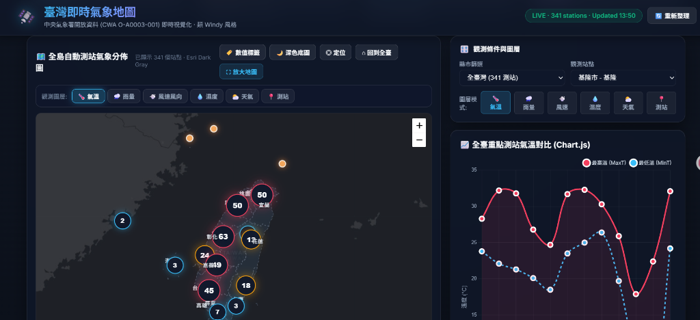
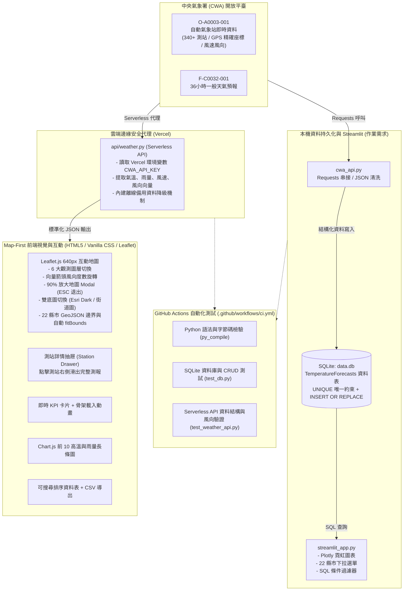

# 🇹🇼 AIoT L3 - 臺灣中央氣象署 (CWA) 氣象觀測與視覺化系統 (Weather Dashboard)

[](https://github.com/Augustine-723/AIoT_L3_CWA_HW1/actions/workflows/ci.yml)
[](https://a-io-t-l3-cwa-hw-1-alpha.vercel.app/)
[](LICENSE)
[](https://www.python.org/)
[](https://leafletjs.com/)
[](https://www.chartjs.org/)



> 🔗 **線上展示網址 (Vercel Live)**: [https://a-io-t-l3-cwa-hw-1-alpha.vercel.app/](https://a-io-t-l3-cwa-hw-1-alpha.vercel.app/)

本專案為 **AIoT L3 HW1** 作業成果，參考 [taiwan-weather-map.vercel.app](https://taiwan-weather-map.vercel.app/) 的 **Map-First（以地圖為核心）** UI/UX 設計理念，打造**類 Windy 風格、深色玻璃擬態 (Dark Glassmorphism)** 的全臺即時氣象觀測與視覺化儀表板。

---

## ⚡ 雙架構雙平臺支援 (Dual Platform Support)

本專案同時具備本機作業規範與現代雲端部署架構：

1. **🌐 Vercel 雲端原生版 (HTML5 + Leaflet + Chart.js + Python Serverless API)**
   - **Map-First 主視覺**：640px 滿版地圖，整合 6 大觀測圖層、向量風向箭頭、全臺縣市邊界與測站詳情抽屜。
   - **90% 放大地圖 (Expand Map Modal)**：一鍵展開近全螢幕沉浸式地圖，支援鍵盤 `ESC` 與自動視窗重繪適配 (`map.invalidateSize()`)。
   - **雲端安全代理**：後端 `/api/weather` 透過 Vercel Function (`api/weather.py`) 安全調用 CWA API，前端嚴格隱藏 API Key，杜絕金鑰洩漏風險。
   - **即時響應式圖表與表格**：整合 Chart.js 全臺前 10 高溫與雨量排行、骨架載入動畫 (Skeleton Loading) 與 CSV 即時導出。

2. **💻 本機完整版 (Streamlit + SQLite + Plotly)**
   - 保留作業規範之 `streamlit_app.py`、`database.py` 與 `data.db`。
   - 支援完整 SQLite CRUD、SQL 條件篩選 (如查詢 MaxT >= 30°C 地區)、Plotly 霓虹折線圖與 22 縣市雙層下拉選單。

---

## 🔄 系統架構與工作流 (Data Pipeline & Workflow)



---

## 🌟 核心特色與 UI/UX 亮點

### 1. 🗺️ Map-First 以地圖為核心的 6 大觀測圖層
使用者可於地圖右上角的浮動控制面板（Glassmorphism Floating Panel）快速切換以下圖層：
- **🌡️ 即時氣溫**：動態色階漸層（藍 ➔ 綠 ➔ 黃 ➔ 橙 ➔ 紅），支援一鍵開啟 **常駐溫標徽章**（如 `28°`），遠距一覽全臺溫差。
- **🌧️ 即時雨量**：多階漸層（藍色微雨 ➔ 紫色豪雨），清晰識別降水熱區。
- **💨 風速風向 (Vector Wind Layer)**：
  - 依照測站 `wind_dir`（0–360°）自動進行 **CSS 幾何旋轉方向箭頭** (`transform: rotate(Ndeg)`)。
  - Marker 即時顯示風速數值（例如 `3.2` m/s），缺值自動呈現 `--`，完全防護 `undefined` / `NaN`。
- **💧 相對濕度**：以青藍發光漸層標示全臺大氣水氣飽和度。
- **⛅ 天氣現象**：晴、多雲、短暫陣雨等天氣圖示化狀態。
- **📍 測站點位**：極簡冷光科技藍圓點，利於宏觀掌握 340+ 個觀測點分布。

### 2. 🎛️ 地圖快捷工具列 (Quick Action Toolbar)
- **🏷️ 數值標籤**：一鍵切換測站數值與純圓點模式，適合不同縮放層級觀測。
- **🌙 雙底圖切換**：深色模式 (Esri World Dark Gray) 與淺色街道模式 (CartoDB Positron / OSM) 即時切換。
- **🎯 瀏覽器定位**：快速取得使用者經緯度並聚焦定位至所在行政區氣象。
- **⌂ 回到全臺**：一鍵將地圖視角自動平滑復原至全臺整體視角 (`fitBounds`)。
- **⛶ 90% 放大地圖 (Expand Map Modal)**：展開覆蓋 90% 寬高沉浸式地圖，支援鍵盤 `ESC` 與自動視窗重繪 (`map.invalidateSize()`)。

### 3. 📈 全臺重點測站氣溫對比 (Chart.js)
- 右側即時呈現重點測站氣溫對比圖，以平滑雙曲線呈現各站 **🔴 當日最高溫 (MaxT)** 與 **🔵 當日最低溫 (MinT)**。
- 支援懸浮 Tooltip 詳情查閱與響應式重繪。

### 4. 📐 臺灣 22 縣市 GeoJSON 幾何邊界與視角導航
- 內建 `tw_counties.js` 高精度行政區邊界向量。
- 滑鼠移入各縣市時產生發光高亮外框；下拉選單選取縣市時，地圖自動呼叫 `fitBounds()` 平滑縮放聚焦至該縣市。

### 5. 📋 側邊測站抽屜 (Station Drawer)
- 點擊地圖任一測站或資料表項目時，右側以 300ms 動畫滑出專屬抽屜面板。
- 完整呈現：**測站 ID、所屬縣市與行政區、即時狀態、海拔高度、GPS 經緯度、氣溫、降雨、濕度、風向向量與最後觀測時間**。

### 6. 🔒 企業級無伺服器金鑰防護 (Zero-Leak Vercel Serverless)
- 前端程式碼完全不寫入或暴露出 `CWA-55FDA...` 金鑰。
- 透過後端 `api/weather.py` 讀取雲端環境變數代理轉發，且相依套件經嚴格瘦身，符合 Vercel Serverless Function 規格。

---

## 📂 專案目錄結構

```text
AIoT_L3_CWA_HW1/
│
├── .github/
│   └── workflows/
│       └── ci.yml             # GitHub Actions CI 自動化測試腳本
│
├── api/
│   ├── weather.py             # Vercel Serverless Function 代理 API (隱藏 CWA 金鑰)
│   └── requirements.txt       # 雲端函數專用羽量依賴
│
├── assets/
│   └── preview.png            # 系統成果展示截圖
│
├── index.html                 # Vercel Map-First 前端介面 (640px 地圖、放大 Modal、抽屜面板)
├── script.js                  # 前端互動邏輯 (Leaflet 6 圖層、風向箭頭向量、Chart.js、CSV)
├── style.css                  # 深色玻璃擬態設計系統 (Glassmorphism, 霓虹光暈, 響應式斷點)
├── tw_counties.js             # 臺灣 22 縣市 GeoJSON 向量行政邊界資料
├── vercel.json                # Vercel 路由配置 (/api/weather -> api/weather.py)
├── .vercelignore              # 雲端部署排除清單 (加速 Build 時間)
│
├── streamlit_app.py           # Streamlit 原生 Web 應用程式 (作業完整版)
├── database.py                # SQLite 資料庫 CRUD 模組 (UNIQUE 約束與 SQL 篩選)
├── cwa_api.py                 # CWA 資料串接、JSON 解析與離線模擬生成模組
├── test_db.py                 # SQLite 資料庫 6 大步驟單元測試
├── test_weather_api.py        # Serverless API 與資料結構驗證測試
├── data.db                    # 本機 SQLite 資料庫實體檔
├── requirements.txt           # 雲端部署專用精簡清單
├── requirements-streamlit.txt # 本機 Streamlit + SQLite 完整環境清單
└── README.md                  # 專案詳細說明與架構文檔
```

---

## 🚀 本機執行教學 (Local Streamlit & SQLite)

### 1. 複製專案
```bash
git clone https://github.com/Augustine-723/AIoT_L3_CWA_HW1.git
cd AIoT_L3_CWA_HW1
```

### 2. 建立虛擬環境並安裝完整相依套件
```bash
python -m venv .venv

# Windows:
.venv\Scripts\activate
# macOS / Linux:
source .venv/bin/activate

# 安裝完整套件 (含 Streamlit、Pandas、Plotly 等)：
pip install -r requirements-streamlit.txt
```

### 3. 設定環境變數
```bash
cp .env.example .env
# 編輯 .env 填入你的 CWA_API_KEY
```

### 4. 執行自動化測試套件
```bash
# 1. 測試 SQLite 資料庫與預報解析：
python test_db.py

# 2. 測試 Serverless 氣象 API 資料結構與風向向量：
python test_weather_api.py
```
> 若顯示 `[ALL PASS]` 與 `OK` 即表示本機端所有資料庫與資料結構皆完全正常。

### 5. 啟動 Streamlit 應用程式
```bash
streamlit run streamlit_app.py
```
瀏覽器將自動開啟 `http://localhost:8501`。

---

## ☁️ 雲端部署指南 (Vercel Deployment)

本專案原生支援 Vercel 一鍵無伺服器部署：

1. 前往 [Vercel 官網](https://vercel.com) 並以 **GitHub 帳號登入**。
2. 點擊 **「Add New...」➔「Project」**。
3. 匯入 **`Augustine-723/AIoT_L3_CWA_HW1`**。
4. 在 **Environment Variables** 區域新增：
   - **Key**: `CWA_API_KEY`
   - **Value**: `你的 CWA 氣象授權金鑰`
5. 點擊 **「Deploy」** 按鈕。
6. 建置流程約 15 秒內完成，即可獲得正式 HTTPS 網址！

> 💡 **自動持續部署 (CD)**：未來只要推送程式碼至 GitHub `main` 分支，Vercel 將自動觸發重新建置與發布。

---

## ⚙️ GitHub Actions CI 工作流說明

專案內建 [`.github/workflows/ci.yml`](.github/workflows/ci.yml)：
- **觸發時機**：每當有程式碼推送 (`push`) 或發起拉取請求 (`pull_request`) 至 `main` 分支時自動啟動。
- **自動化步驟**：
  1. 檢出程式碼 (`actions/checkout@v4`)。
  2. 配置 Python 3.11 測試環境 (`actions/setup-python@v5`)。
  3. 安裝完整相依套件 (`pip install -r requirements-streamlit.txt`)。
  4. 執行語法與字節碼檢驗 (`python -m py_compile ...`)，確保零語法錯誤。
  5. 執行 `test_db.py` 驗證 SQLite 資料庫讀寫、SQL 條件篩選與唯一鍵防護。
  6. 執行 `test_weather_api.py` 驗證 Serverless 氣象 API 資料欄位完整度與風向風速邊界。

---

## 🗄️ 資料庫結構 (Database Schema)

| 欄位名稱 | 型態 | 說明 | 備註 |
| :--- | :--- | :--- | :--- |
| `id` | INTEGER | 主鍵 (Primary Key) | 自動遞增 |
| `location_name` | TEXT | 測站或地區名稱 | 例如：臺北市 - 臺北、新北市 - 板橋 |
| `start_time` | TEXT | 觀測或預報起始時間 | `YYYY-MM-DD HH:MM:SS` |
| `end_time` | TEXT | 觀測或預報結束時間 | `YYYY-MM-DD HH:MM:SS` |
| `min_temp` | REAL | 最低溫度 / 當日最低溫 | 攝氏度 (°C) |
| `max_temp` | REAL | 最高溫度 / 當日最高溫 | 攝氏度 (°C) |
| `weather_condition`| TEXT | 天氣現象 (Wx) | 例如：多雲時晴、陰局部雨 |
| `rain_prob` | TEXT | 雨量或降雨機率 | 例如：0.0 mm、20% |
| `comfort_index` | TEXT | 大氣指標 | 例如：濕度 65%, 氣壓 1013 hPa |
| `lat` | REAL | 測站緯度 (WGS84) | 供 Leaflet / Folium 精準地圖定位 |
| `lon` | REAL | 測站經度 (WGS84) | 供 Leaflet / Folium 精準地圖定位 |
| `created_at` | TIMESTAMP| 資料寫入時間 | 預設為當前時間戳記 |

---

## 📝 授權聲明 (License)
本專案為學習與作業評量用途開源釋出。氣象資料來源屬於 [中華民國中央氣象署開放資料平臺](https://opendata.cwa.gov.tw/)。
